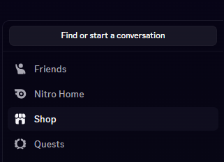
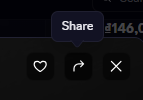
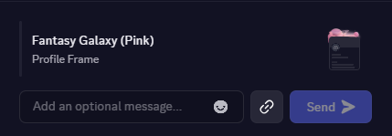

# CustomProfileEnhanced

CustomProfileEnhanced is a community-maintained backport of Nightcord's `CustomProfile` plugin, adapted to run as an Equicord userplugin. It exists so users can access the profile customization features without installing or running the Nightcord client.

This project is not affiliated with, endorsed by or supported by Nightcord, Equicord, Vencord or Discord Inc.

## Security and responsibility

The backported code has been reviewed and adapted so that it does not read, store or transmit your Discord account token. It does not include Nightcord's account-token synchronization code and does not connect to Nightcord's synchronization services.

Custom profile data, fake account previews and per-user custom statuses are stored locally. The plugin makes network requests only when needed to:

- Load collectible metadata from Discord for Avatar Decorations, Profile Effects, Nameplates and experimental Profile Frames.
- Load badge metadata from the configured Global Badges API. The default is `https://badges.equicord.org/`.
- Display assets hosted by Discord's CDN or links explicitly configured by the user.

No security review can guarantee that third-party software will remain risk-free forever. Discord and Equicord can change, third-party services can change, and future modifications to this repository may introduce new risks. Review changes before updating and install only from a repository you trust.

**YOU USE THIS PLUGIN ENTIRELY AT YOUR OWN RISK. YOU ARE RESPONSIBLE FOR YOUR ACCOUNT, CLIENT, DATA AND COMPLIANCE WITH DISCORD'S TERMS OF SERVICE.**

## Intended audience

This plugin is intended for experienced Equicord/Vencord users who are comfortable reviewing source code, managing userplugins and building Equicord from source.

CustomProfileEnhanced is intentionally distributed only as a userplugin. It is not eligible for merge into Equicord's official plugin collection because Equicord's plugin policy prohibits client-state spoofing.

No prebuilt binaries or one-click installation method are provided intentionally. If you are unfamiliar with Equicord's build process or do not understand what this plugin changes, you should not use it.

Review the source before building and use it at your own discretion.

## Features

- Local profile overrides for username, display name, bio, pronouns, account creation date, email and phone previews.
- Local avatar, banner, profile color and Nitro appearance previews.
- Custom Discord badge previews and Global Badges integration.
- Discord Shop link or SKU ID support for Avatar Decorations, Profile Effects, Nameplates and experimental Profile Frames.
- Local profile connections.
- Local custom statuses for individual users while they are Online or Idle.
- Local fake account entries and profile previews in Discord's account switcher.

All spoofed profile changes are local-only. Other Discord users will not see them.

## Enhancements over the original plugin

CustomProfileEnhanced adds the following features that were not available in the original Nightcord `CustomProfile` plugin:

- **Per-user Custom Status:** Set a local custom status for an individual user from their context menu. The override is shown only while that user is Online or Idle and never leaves your device.
- **Nameplate spoofing:** Apply a Discord Shop Nameplate locally by pasting its Shop link or SKU ID.
- **Profile Frame spoofing:** Apply Discord's newer Profile Frame collectibles locally. This integration is experimental because Discord is still changing the feature.

## How to get and use a Discord Shop SKU ID

You do not need to extract the SKU ID manually. CustomProfileEnhanced accepts the complete Discord Shop share link and automatically reads the number after `itemSkuId=`.

1. Open Discord and select **Shop** from the left sidebar.

   

2. Find and open the Avatar Decoration, Profile Effect, Nameplate or Profile Frame you want to spoof. Click the **Share** button near the top-right corner of the item preview.

   

3. In the share panel, click the **Copy Link** button with the chain-link icon at the bottom.

   

4. Open **Equicord Settings → Plugins → CustomProfileEnhanced**, open the Custom Profile editor and select **Badges & Collectibles**. Paste the complete copied link into the matching **Custom SKU ID** field:

   - Paste an Avatar Decoration link into **Avatar Decoration**.
   - Paste a Profile Effect link into **Profile Effect**.
   - Paste a Nameplate link into **Nameplate**.
   - Paste a Profile Frame link into **Profile Frame (Experimental)**.

5. Click **Save**. The plugin fetches the matching collectible metadata and stores the local override.

For example, in `https://ptb.discord.com/shop#itemSkuId=1491907428344795276`, the SKU ID is `1491907428344795276`. Each Shop item must be pasted into its matching field; a Profile Effect SKU will not work in the Avatar Decoration field.

## Installation

> [!IMPORTANT]
> **YOU MUST BUILD EQUICORD FROM SOURCE BEFORE YOU CAN USE THIS OR ANY SIMILAR USERPLUGIN. PREBUILT EQUICORD DOWNLOADS DO NOT LOAD SOURCE USERPLUGINS.**

### 1. Build Equicord from source

Follow Equicord's official [Building from Source guide](https://docs.equicord.org/building-from-source). Complete the guide and make sure the source build works before installing this userplugin.

### 2. Install CustomProfileEnhanced

Follow Equicord's official [Installing User Plugins guide](https://docs.equicord.org/plugins) to add this plugin to the correct folder. Use this repository as the plugin source: `https://github.com/xVanDat/customProfileEnhanced`.

### 3. Rebuild Equicord with the userplugin

```shell
pnpm build
```

You must rebuild Equicord whenever you install or update this plugin.

### 4. Inject the rebuilt Equicord client

```shell
pnpm inject
```

Fully restart Discord, open Equicord Settings, find **CustomProfileEnhanced** in the Plugins tab and enable it. Because the plugin patches Discord's profile UI, restart Discord again after enabling or disabling it.

## Updating

From `Equicord/src/userplugins/customProfileEnhanced`:

```shell
git pull
cd ../../..
pnpm build
pnpm inject
```

Review the incoming changes before rebuilding and injecting them.

## Compatibility

Profile Frames are experimental because Discord is still changing this feature. A valid Shop SKU may temporarily fail if Discord changes the collectible metadata format.

## Origin and licensing

This plugin was backported from Nightcord's plugin named `CustomProfile` and adapted for Equicord. The source retains the existing Vencord/Equicord GPL attribution headers. Modifications and redistribution are provided under the GNU General Public License v3.0 or later.

Nightcord is credited only as the source of the original plugin implementation. This backport does not require Nightcord and does not reuse Nightcord's token synchronization service.
